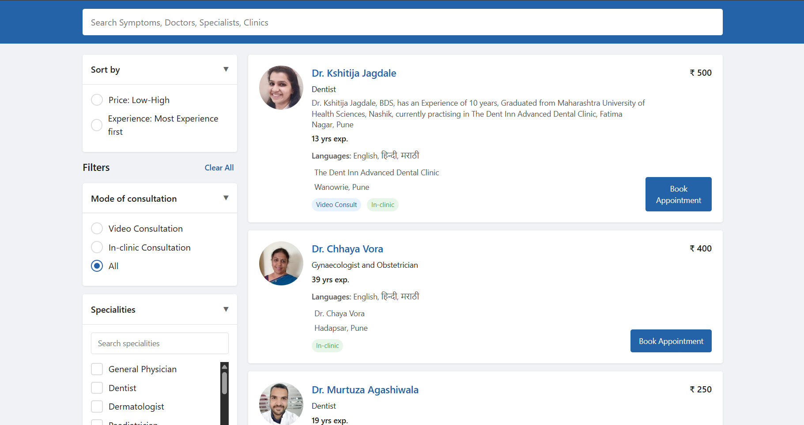

# Bajaj Finserv Frontend Task

My implementation for the frontend task given by Bajaj Finserv.

## Description

This project implements a dynamic and functional doctor listing page where users can search, filter, and sort doctors from a provided dataset. All search, filtering, and sorting happen on the client side after the initial API call, ensuring a seamless user

This project is developed using **React** and **TypeScript** with **Vite** as the build tool. It provides a minimal setup to get started with development and includes HMR (Hot Module Replacement) for faster updates.

---

## Screenshot



## Features

### 1. **Autocomplete Search Bar**

- Displays top 3 matches based on doctor names.
- Dropdown updates dynamically as users type.
- Filters the doctor list when a suggestion is clicked or Enter is pressed.
- No suggestions are shown if no match is found.

### 2. **Dynamic Filter Panel**

#### Consultation Type (Radio):

- Options: Video Consult, In Clinic.
- Single-select functionality.

#### Specialties (Checkbox):

- Multi-select filter based on doctor specialties from the dataset.
- Doctors can have multiple specialties.

#### Sort Options:

- Fees (ascending).
- Experience (descending).

Filters are applied in combination, with precedence based on order.

### 3. **Doctor Listing**

- Doctor cards display essential information:
  - Name
  - Specialties
  - Experience
  - Consultation fees
- All data is fetched from the provided API.

---

## Installation

1. Clone the repository:

   ```bash
   git clone https://github.com/Ayush-Singh24/bajaj.git
   ```

2. Navigate to the project directory:
   ```bash
   cd bajaj
   ```

---

## Getting Started

### Step 1: Install Dependencies

Run the following command to install all necessary packages:

```bash
npm install
```

### Step 2: Create the production ready build

Run the following command to start the development server:

```bash
npm run build
```

### Step 3: Preview the production build

To preview the production build locally, execute:

```bash
npm run preview
```

### Starting Development Server

To start the development server, use command:

```bash
npm run dev
```
